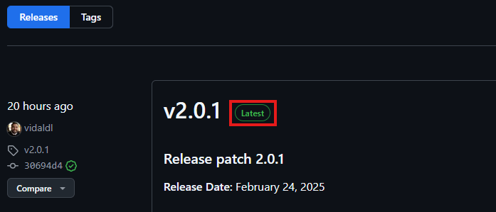
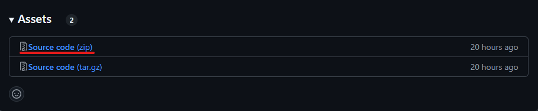
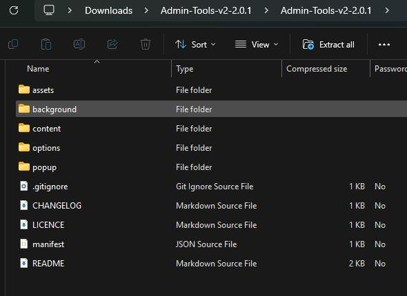
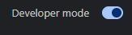
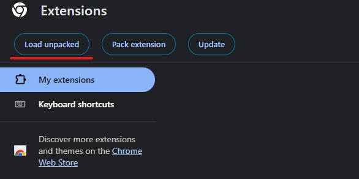
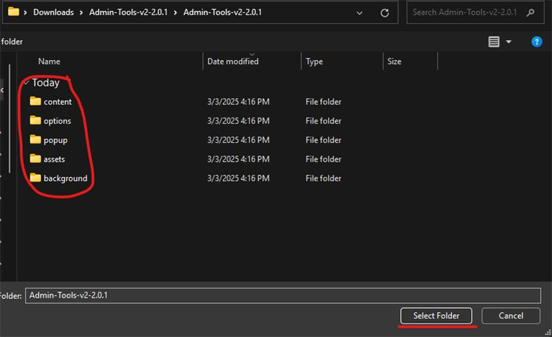
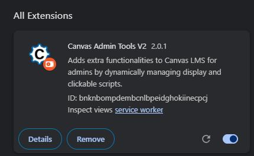
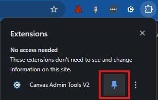

# Installation Guide
This is a step-by-step guide on how to install the new working version of the Canvas Admin Tools Chrome extension. Follow these steps to get it up and running!

---
### 🔽 Step 1: Download the Extension from GitHub

1. Go to the **[Releases](https://github.com/vidaldl/Admin-Tools-v2/releases)** page and find the release marked with **"Latest"**. 

    

2. Click on the **.zip** file under "Assets" to download it.

    
---

### 📂 Step 2: Extract the Extension
1. Once downloaded, locate the .zip file on your computer.

2. Right-click the file and select Extract All (Windows) or Double-click to unzip (Mac).

3. Make sure you remember where the extracted folder is located.

    

---

### 🛠️ Step 3: Enable Developer Mode in Chrome
1. Open Google Chrome and go to `chrome://extensions/`.

2. In the top right corner, toggle **Developer mode** ON.

    

---
### 📂 Step 4: Load the Unpacked Extension

1. Click the Load unpacked button.

    

2. Navigate to the folder where you extracted the extension.

3. Select the folder and click Open. Make sure you are inside the unzipped folder that has 5 sub-folders.

    

---
### ✅ Step 5: Verify Installation

1. The extension should now appear in your list of installed extensions.

    

2. **Pin** the extension by clicking the puzzle icon in the Chrome toolbar and selecting the pin icon.

    
---

### 🎉 You're Done!
Your extension is now installed and ready to use. You should be able to go to the options page by pressing the cog in the popup and turn on any functionalities that you might want. You can see in more detail what they can do [here](./README.md).
 