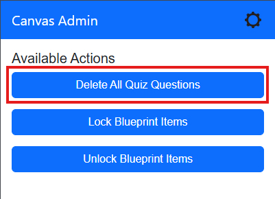
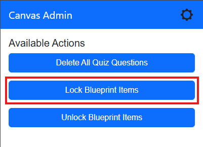
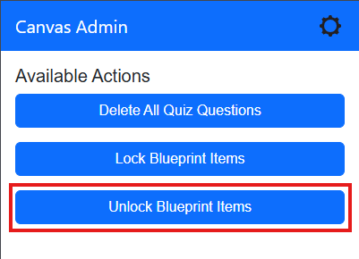
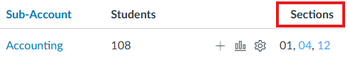
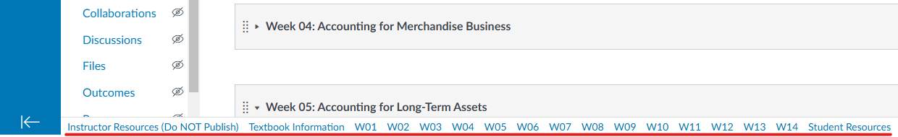
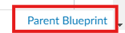

# Canvas Admin Tools V2

Canvas Admin Tools V2 is a Chrome extension designed to enhance the Canvas LMS for administrators by adding extra functionalities through dynamically managed display and clickable scripts.

This extension is a refactored version of [BYUI Canvas Admin Tools](https://github.com/byuitechops/BYUI-Canvas-Admin-Tools) in manifest V3 of Google's extensions platform. 

## Table of Contents
- [Installation](#installation)
- [Features](#features)
  - [Clickables](#clickables)
    - [Delete All Quiz Questions](#delete-all-quiz-questions)
    - [Lock Blueprint Items](#lock-blueprint-items)
    - [Unlock Blueprint Items](#unlock-blueprint-items)
  - [Displays](#displays)
    - [Sections Column](#sections-column)
    - [Sections in Breadcrumbs](#sections-in-breadcrumbs)
    - [Module Navbar](#module-navbar)
    - [Blueprint Parent Link](#blueprint-parent-link)
    - [Blueprint Associated Sections](#blueprint-associated-sections)
    - [Select All Files Button](#select-all-files-button)
- [Options](#options)
- [Contributing](#contributing)
- [License](#license)

## Installation

1. Clone the repository or download the ZIP file.
2. Open Chrome and navigate to `chrome://extensions/`.
3. Enable "Developer mode" using the toggle in the top right corner.
4. Click "Load unpacked" and select the directory containing the extension files.

## Features

### Clickables

Clickables are scripts that are triggered manually from the extension's popup. They automate tasks and reduce multiple button clicks to just a few.

#### Delete All Quiz Questions

Deletes all questions in a given quiz.

**Usage:**
1. Navigate to a quiz edit page in Canvas.
2. Open the extension popup.
3. Click the "Delete All Quiz Questions" button.
4. Confirm the deletion in the prompt.

#### Lock Blueprint Items

Locks every blueprint item present on the page.

**Usage:**
1. Navigate to a page with blueprint items (e.g., modules, assignments).
2. Open the extension popup.
3. Click the "Lock Blueprint Items" button.

#### Unlock Blueprint Items

Unlocks every blueprint item present on the page.

**Usage:**
1. Navigate to a page with blueprint items (e.g., modules, assignments).
2. Open the extension popup.
3. Click the "Unlock Blueprint Items" button.

### Displays

Displays are scripts that run automatically on specific pages to enhance navigation and provide quick information.

#### Sections Column

Adds a dedicated "Sections" column to the course listings on Canvas. Any cross-listed sections are highlighted in blue.

**Usage:**
1. Navigate to the course listings page.
2. The "Sections" column will be automatically added.

#### Sections in Breadcrumbs

Enhances the breadcrumb trail by appending formatted section numbers for the current course. Cross-listed sections are highlighted light blue.

**Usage:**
1. Navigate to a course page.
2. The breadcrumb trail will be automatically enhanced with section numbers.

#### Module Navbar

Displays a navbar on the modules page of a course.

**Usage:**
1. Navigate to the modules page of a course.
2. The navbar will be automatically added at the bottom of the page.

#### Blueprint Parent Link

Adds a link at the bottom of the page to a course's blueprint if it is a blueprint child.

**Usage:**
1. Navigate to a course page.
2. The link to the parent blueprint will be automatically added at the bottom of the page.

#### Blueprint Associated Sections

Adds a link to the sections associated with a blueprint course when in "Associated Courses".

**Usage:**
1. Navigate to the blueprint associations page.
2. Links to the associated sections will be automatically added.

#### Select All Files Button

Adds a "Select All" button to the Files page in Canvas.

**Usage:**
1. Navigate to the Files page of a course.
2. The "Select All" button will be automatically added.

## Options

The extension provides an options page to enable or disable specific clickables and displays.

**Usage:**
1. Open the extension options page.
2. Toggle the desired clickables and displays.

## Contributing

Contributions are welcome! Please fork the repository and submit a pull request with your changes.

## License

This project is licensed under the MIT License. See the LICENSE file for details.
