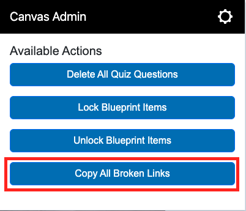
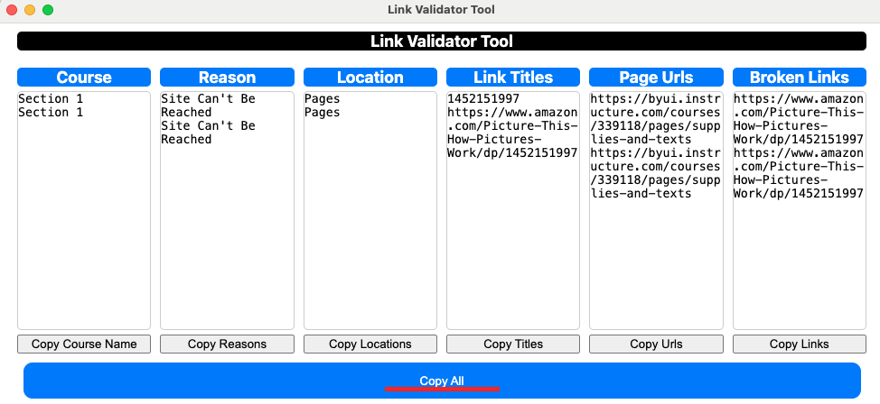
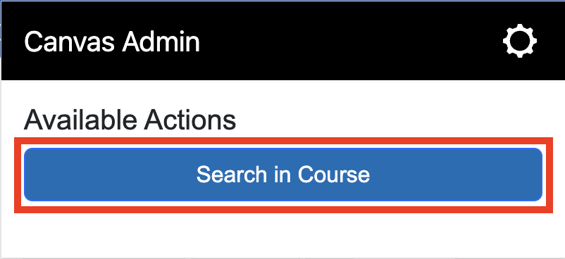
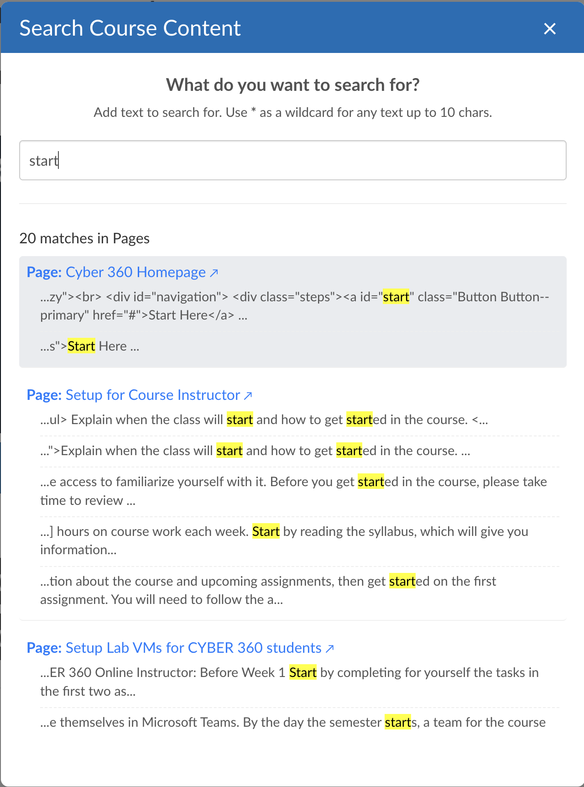
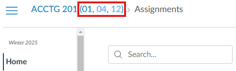
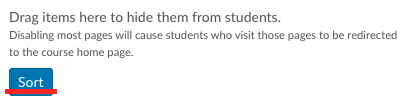

# Canvas Admin Tools V2

Canvas Admin Tools V2 is a Chrome extension designed to enhance the Canvas LMS for administrators by adding extra functionalities through dynamically managed display and clickable scripts.

This extension is a refactored version of [BYUI Canvas Admin Tools](https://github.com/byuitechops/BYUI-Canvas-Admin-Tools) in Manifest V3 of Google's extensions platform.

## Table of Contents
- [Installation](#installation)
- [Features](#features)
  - [Clickables](#clickables)
    - [Delete All Quiz Questions](#delete-all-quiz-questions)
    - [Lock Blueprint Items](#lock-blueprint-items)
    - [Unlock Blueprint Items](#unlock-blueprint-items)
    - [Copy Broken Links](#copy-broken-links)
    = [Search In Course](#search-in-course)
  - [Displays](#displays)
    - [Sections Column](#sections-column)
    - [Sections in Breadcrumbs](#sections-in-breadcrumbs)
    - [Module Navbar](#module-navbar)
    - [Blueprint Parent Link](#blueprint-parent-link)
    - [Blueprint Associated Sections](#blueprint-associated-sections)
    - [Select All Files Button](#select-all-files-button)
    - [Sort Navigation Button](#sort-navigation-button)
- [Options](#options)
- [Contributing](#contributing)
- [License](#license)

## Installation

Follow the instructions in the **[Installation Guide](./INSTALL.md)**.

## Features

### Clickables

Clickables are scripts triggered manually from the extension’s popup. They automate tasks to reduce multiple button clicks into just a few.

#### Delete All Quiz Questions

Deletes all questions in a given quiz.

**Usage:**
1. Navigate to a quiz edit page in Canvas.  
2. Open the extension popup.  
3. Click the **Delete All Quiz Questions** button.  
4. Confirm the deletion in the prompt.

#### Lock Blueprint Items

Locks every blueprint item present on the page.

**Usage:**
1. Navigate to a page with blueprint items (e.g., modules, assignments).  
2. Open the extension popup.  
3. Click the **Lock Blueprint Items** button.

#### Unlock Blueprint Items

Unlocks every blueprint item present on the page.

**Usage:**
1. Navigate to a page with blueprint items (e.g., modules, assignments).  
2. Open the extension popup.  
3. Click the **Unlock Blueprint Items** button.

#### Copy Broken Links

Displays a window with all broken links in the course and allows you to copy them to the clipboard.

**Usage:**
1. Navigate to the Course Link Validator of any course 
2. Open the extension popup.  
3. Click the **Copy All Broken Links** button.
4. Copy individual columns or all of them by clickinng on **Copy All**. They are formatted to be pasted in a spreadsheet as columns and rows.

#### Search In Course

Displays a window with a search bar that allows the search of any text in the content of the course.

**Usage:**
1. Navigate to the hom epage of any course 
2. Open the extension popup.  
3. Click the **Search in Course** button.
4. After loading is complete, search any text in the course content.

### Displays

Displays are scripts running automatically on specific pages to enhance navigation and provide quick information.

#### Sections Column

Adds a dedicated "Sections" column to the course listings on Canvas. Any cross-listed sections are highlighted in blue.

**Usage:**
1. Navigate to the course listings page.  
2. The "Sections" column is automatically added.

#### Sections in Breadcrumbs

Enhances the breadcrumb trail by appending formatted section numbers for the current course. Cross-listed sections are highlighted in light blue.

**Usage:**
1. Navigate to a course page.  
2. The breadcrumb trail is automatically enhanced with section numbers.

#### Module Navbar

Displays a navbar on the modules page of a course.

**Usage:**
1. Navigate to the modules page of a course.  
2. The navbar is automatically added at the bottom of the page.

#### Blueprint Parent Link

Adds a link at the bottom of the page to a course’s blueprint if it is a blueprint child.

**Usage:**
1. Navigate to a course page.  
2. The link to the parent blueprint is automatically added.

#### Blueprint Associated Sections

Adds a link to the sections associated with a blueprint course when in "Associated Courses".

**Usage:**
1. Navigate to the blueprint associations page.  
2. Links to the associated sections are automatically added.

#### Select All Files Button

Adds a **Select All** button to the Files page in Canvas.

**Usage:**
1. Navigate to the Files page of a course.  
2. The **Select All** button is automatically added.

#### Sort Navigation Button

Adds a **Sort** button to the Files page in Canvas.

**Usage:**
1. Navigate to the Settings page of a course in the **Navigation** tab.  
2. Click **Sort** button and it will alphabetically sort the disabled items of the navigation.

## Options

The extension offers an options page to enable or disable specific clickables and displays.

**Usage:**
1. Open the extension options page: click the cog icon in the popup  
     
2. Toggle the desired clickables and displays.  
   

## Contributing

Contributions are welcome! Please fork the repository and submit a pull request with your changes.

## License

This project is licensed under the MIT License. See the [LICENSE](./LICENSE) file for details.
